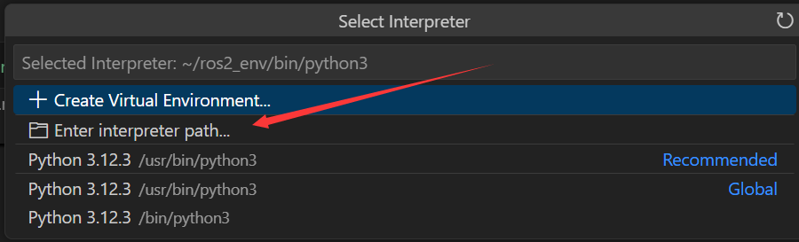

  
---

# 前言

配置项目运行环境。

# 配置开发环境

❇️创建虚拟环境

```shell
unminimize

# python3 -m venv ~/ros2_env 
# echo "source ~/ros2_env/bin/activate" > ~/.bashrc
# source ~/.bashrc

# 删除虚拟环境
# rm -rf ~/ros2_env

# ❇️安装anaconda
cd /root/workspace/downloads
wget https://repo.anaconda.com/archive/Anaconda3-2025.06-0-Linux-x86_64.sh

chmod +x Anaconda3-2025.06-0-Linux-x86_64.sh
bash Anaconda3-2025.06-0-Linux-x86_64.sh

# 创建虚拟环境
conda create -n visual_slam python=3.12 -y

# 切换到新创建的虚拟环境
conda activate visual_slam

# 安装jupyter notebook
conda install jupyter notebook -y
conda install jupyter_contrib_nbextensions -y

# 安装C++ kernel
conda install xeus-cling -c conda-forge -y

# 检查是否成功安装了kernel
jupyter kernelspec list

# 运行jupyter notebook
# conda activate visual_slam
# jupyter notebook --allow-root
# # 或者启动lab【有目录】
jupyter lab --allow-root
```

❇️安装ros2

```shell
pip install pyyaml distro-info distro

# 按照鱼香ros一键安装完整的ros2:jazzy
sudo apt update
wget http://fishros.com/install -O fishros && bash fishros

# 打开新的终端，安装gz
sudo apt-get update
sudo apt-get install curl lsb-release gnupg -y
sudo curl https://packages.osrfoundation.org/gazebo.gpg --output /usr/share/keyrings/pkgs-osrf-archive-keyring.gpg
echo "deb [arch=$(dpkg --print-architecture) signed-by=/usr/share/keyrings/pkgs-osrf-archive-keyring.gpg] http://packages.osrfoundation.org/gazebo/ubuntu-stable $(lsb_release -cs) main" | sudo tee /etc/apt/sources.list.d/gazebo-stable.list > /dev/null

sudo apt-get update -y
sudo apt-get install gz-harmonic -y

# 安装远程显示服务程序
apt install x11-xserver-utils libxcb* -y

# 安装moveit
apt install ros-${ROS_DISTRO}-moveit* -y

# 安装ros2的控制功能包
sudo apt install ros-${ROS_DISTRO}-controller-manager -y
sudo apt install ros-${ROS_DISTRO}-joint-trajectory-controller -y
sudo apt install ros-${ROS_DISTRO}-joint-state-broadcaster -y
sudo apt install ros-${ROS_DISTRO}-diff-drive-controller -y

# 安装其他功能包
apt install ros-${ROS_DISTRO}-ros-gz -y #ros_gz
apt-get install ros-${ROS_DISTRO}-joint-state-publisher-gui -y
apt install ros-${ROS_DISTRO}-moveit-ros-planning-interface -y
# apt install ros-jazzy-gz-ros2-control 这个很重要 https://github.com/ros-controls/gz_ros2_control
apt install ros-${ROS_DISTRO}-gz-ros2-control* -y

# 取消代理（Failed to connect to 127.0.0.1 port 1008）
# cd /workspace
git config --global --unset http.proxy
git config --global --unset https.proxy

# 使用代理
# git config --global http.proxy "http://127.0.0.1:7890"
# git config --global https.proxy "http://127.0.0.1:7890"

# 用于调试，可不安装
apt-get install gdb -y

conda activate visual_slam
cd GraphExecuter/graph_executer
pip install -r requirements_moveit2_yolobb_ws.txt

cd /root/workspace/downloads
git clone https://github.com/laoxue888/NodeGraphQt.git
cd /root/workspace/downloads/NodeGraphQt
pip install -e . 
```

❇️添加终端启动sh

```shell
echo "source /opt/ros/jazzy/setup.bash" > ~/.bashrc
source ~/.bashrc
```

❇️安装必要的第三方库

```shell
pip install empy catkin_pkg lark jinja2 typeguard
sudo apt install python3-colcon-common-extensions -y
```

❇️设置Python文件运行路径





```bash
~/ros2_env/bin/python3
```

❇️配置jupyter-notebook环境

```shell
pip install jupyter jupyter-contrib-nbextensions notebook bqplot pyyaml ipywidgets jupyros

echo "export PATH=~/.local/bin:${PATH}" > ~/.bashrc
source ~/.bashrc

# 取消代理（Failed to connect to 127.0.0.1 port 1008）
git config --global --unset http.proxy
git config --global --unset https.proxy

# 使用代理
git config --global http.proxy "http://127.0.0.1:7890"
git config --global https.proxy "http://127.0.0.1:7890"
```

# 报错

## pyhon版本问题

```shell
ModuleNotFoundError: No module named 'rclpy._rclpy_pybind11'
The C extension '/opt/ros/jazzy/lib/python3.12/site-packages/_rclpy_pybind11.cpython-310-x86_64-linux-gnu.so' isn't present on the system. Please refer to 'https://docs.ros.org/en/jazzy/How-To-Guides/Installation-Troubleshooting.html#import-failing-without-library-present-on-the-system' for possible solutions
```

分析报错信息可知是Python版本不匹配，需要安装对应版本的rclpy。

1、安装python3.12版本即可。  
2、安装C++ kernel。
```shell
conda install -c conda-forge libstdcxx-ng
```