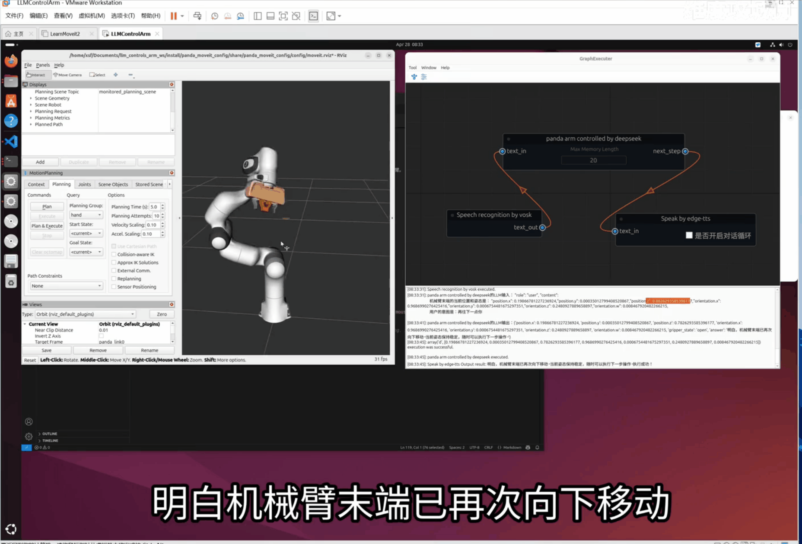
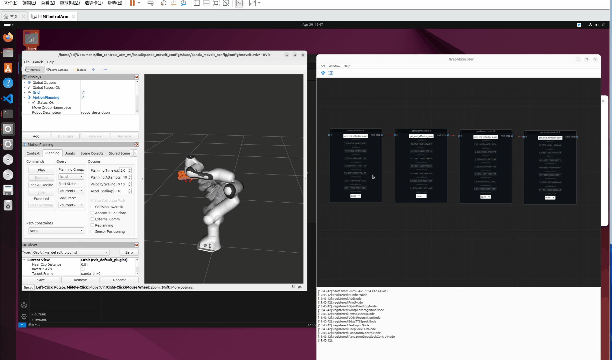
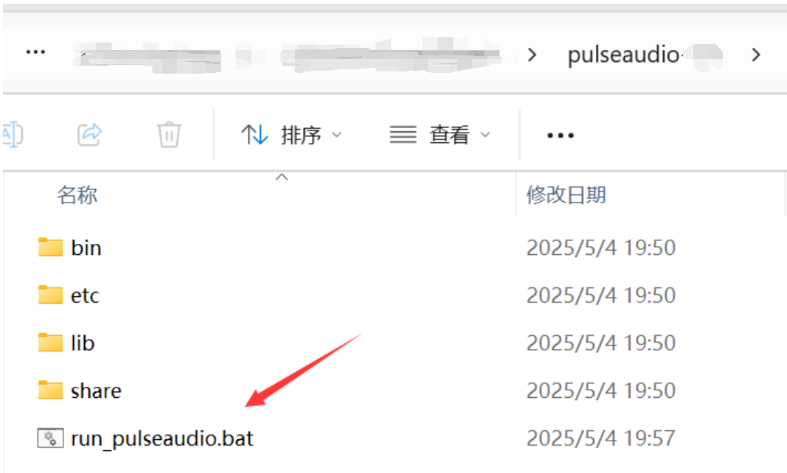


# LLMControlsArm

## 前言

|  | |
|:----------------:|:----------------:|
| *DeepSeek控制*       |*机械臂末端位置编排*       |


通过使用智能化的工作流控制系统来精确操控机械臂，不仅能够基于预设算法可靠地规划每个动作步骤的执行顺序和力度，确保作业流程的标准化和可重复性，还能通过模块化的程序设计思路灵活地在原有工作流中插入新的控制节点，这种可扩展的架构设计使得系统能够在不影响既有功能稳定性的前提下，便捷地集成诸如视觉识别、力反馈调节或协同作业等进阶功能模块，从而持续提升机械臂在复杂工业场景中的适应性和多功能性。

这里我增加了DeepSeek控制节点，通过给DeepSeek提示，让它帮助给出机械臂的末端位置。该节点利用大语言模型强大的逻辑推理和空间理解能力，能够将模糊的自然语言指令（如“向右移动5厘米”或“避开红色障碍物”）自动转化为精确的坐标参数和运动轨迹。这一集成显著提升了人机交互效率，使得非专业用户也能通过口语化指令快速完成复杂的位姿调整任务，为柔性生产线或科研实验场景提供了更高层次的智能化支持。


**video**：

- [2025-4-29：超实用的panda机械臂末端位置编排方法](https://www.bilibili.com/video/BV17zGmzLEUL/?vd_source=3bf4271e80f39cfee030114782480463)
- [2025-4-28：【开源】通过DeepSeek大语言模型控制panda机械臂，听懂人话，拟人性回答。智能机械臂助手又进一步啦](https://www.bilibili.com/video/BV15ALCzNE9S/?vd_source=3bf4271e80f39cfee030114782480463)


## 环境配置

- Ubuntu:24.04
- Ros2:jazzy

[👉installation.md👈](./docs/1_Installation/installation2.md)

## 下载项目

```shell
git clone --recurse-submodules https://github.com/laoxue888/LLMControlsArm.git
```

## 运行测试

❇️在windows上运行`PulseAudio`服务

> 这个服务可以让Docker容器访问宿主机的音频设备。

<div align="center">



</div>

❇️编译运行

```shell 
cd /root/workspace/ros2_project
colcon build
```

```shell
# 打开新的终端
cd /root/workspace/ros2_project
source install/setup.bash
ros2 launch control_server arm_control.launch.py
```

```shell
# 打开新的终端
cd /root/workspace/ros2_project
source install/setup.bash
ros2 launch panda_moveit_config demo.launch.py
```
> 启动rviz2后，可以看到机械臂会有干涉，必须手动调整到不干涉的位置，然后才使用moveitpy控制机械臂，否则无法控制机械臂。


```shell
# 打开新的终端
cd /root/workspace/ros2_project
source install/setup.bash

cd /root/workspace/GraphExecuter/graph_executer
python3 main.py
```

## 相关项目

> - [JSON Output](https://api-docs.deepseek.com/zh-cn/guides/json_mode)
> - [DeepSeek提示库](https://api-docs.deepseek.com/zh-cn/prompt-library/)