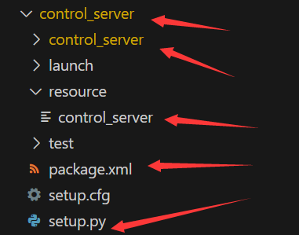

---

> 参考：
> - []()

## 创建功能包

```shell
# 对于CMake包
ros2 pkg create --build-type ament_cmake <package_name>

# 对于Python包
ros2 pkg create --build-type ament_python <package_name>
```

## 重命名功能包

【可选】1. 使用`ros2 pkg create --build-type ament_python <package_name>`创建新的功能包，把`resource`文件夹中的文件复制到待改名的功能包的`resource`文件夹

2. 把这里边的名字对应改一下，然后删掉build、install文件夹，重新编译



```shell
colcon build --symlink-install
```

## 调试

注意调试的时候，在对应的终端要输入：

```shell
source install/setup.bash
```

